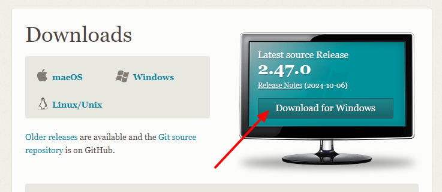
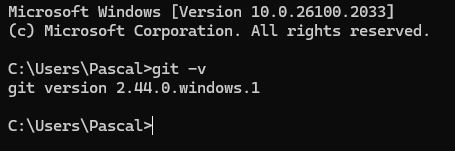
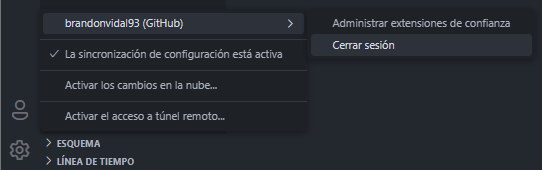
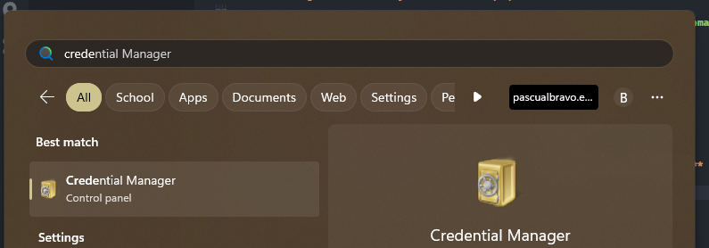
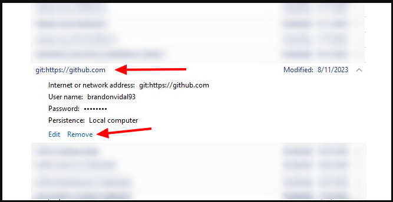

# Configuración Git

Configuración paso a paso de **Git** y **GitHub**.

## **Crear un cuenta GitHub**

Para crear una cuenta en GitHub ingresa al siguiente enlace [(Haz clic aquí)](github.com)


Ten encuenta lo siguiente:

- Si ya tienes cuenta debes dar clic en **`Sign In`**.
- Si no tienes cuenta debes dar clic en **`Sign Up`** y seguir el paso a paso.

Una vez te registres debes conservar los datos que hayas creado o tengas creados:
    
- `Nombre de usuario (username)`
- `Correo electrónico (email)`
- `Contraseña (password)`
    
---

## **Instalar Git en nuestra máquina (PC).**

- Descarga el instalador de la siguiente página: [Descargar aquí](https://git-scm.com/downloads)
  


- Sigue los pasos de instalación.
- Comprueba que Git haya quedado instalado ejecutando en el terminal del equipo **`(CMD)`** 
    
``` bash
git -v
```



Si aparece la versión del Git es que todo ha salido bien.

---

## **Configurar username y email en el equipo**

Para trabajar con repositorios se debe configurar el **`username`** y **`email`**. 

**Ten en cuenta lo siguiente:**

### Si trabajas desde un equipo público (que no es tuyo):

1. Cierra la sesión de GitHub en el Editor **`(Visual Studio Code)`**



2. Abre en Windows el **`Administrador de Credenciales (Credential Manager)`**



3. Selecciona **`Credenciales de Windows (Windows Credentials)`**


4. Busca todas las credenciales que digan **`git:https://github.com`** y da clic en **`Eliminar (Remove)`**



5. Configura tu **`username`** y **`email`** abriendo la Terminal de Windows **`(CMD)`** y escribiendo los siguientes comandos.

**Configurar username**

```bash
git config --global user.name tu-username
```

**Nota:** Donde dice **`tu-username`** coloca tu nombre de usario de GitHub.

**Configurar email**

```bash
git config --global user.email tu-email
```

**Nota:** Donde dice **`tu-email`** coloca tu correo con el que te registraste en GitHub.

#### ¡Importante! Este procedimiento se debe realizar cada vez que se va a trabajar desde un equipo público.

### Si trabajas en tu propio equipo:

Configura tu **`username`** y **`email`** abriendo la Terminal de Windows **`(CMD)`** y escribiendo los siguientes comandos.

**Configurar username**

```bash
git config --global user.name tu-username
```

**Nota:** Donde dice **`tu-username`** coloca tu nombre de usario de GitHub.

**Configurar email**

```bash
git config --global user.email tu-email
```

**Nota:** Donde dice **`tu-email`** coloca tu correo con el que te registraste en GitHub.

De esta manera quedará configurado nuestro equipo con la cuenta propia para trabajar.

---