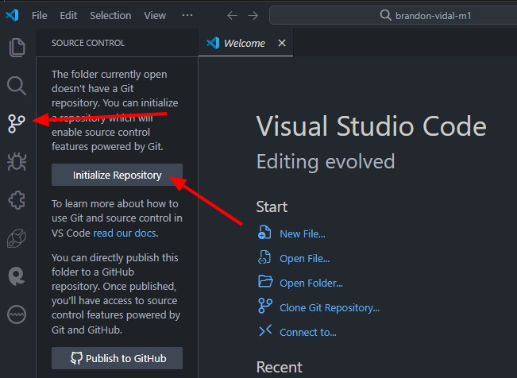

# Comandos Git

## **Inicializar un repositorio**

Para inicializar un repositorio en nuestro proyecto, seguimos los siguientes pasos.

### Desde Visual Studio Code

1. Desde **Visual Studio Code** vamos a la opción de **Source Control (Control de código)**



2. Damos clic en **`Initialize Repository (Inicializar repositorio)`**. Sino aparece este botón debemos realizar el proceso desde la Terminal de Windows **`(CMD)`**.

### Desde la Terminal de Windows

1. Nos ubicamos en la carpeta donde tenemos los archivos de nuestro proyecto y damos **`clic`** en la ruta de ubicación, borramos la dirección y escribimos **`(CMD)`**


2. Presionamos la tecla **`Enter`**, esto abrirá la Terminal de Windonws en la ruta de nuestro proyecto.


**Nota:** Debemos fijarnos que estemos ubicados en la ruta del proyecto para continuar con el proceso.

3. En la Terminal escribimos el siguiente comando:

```bash
git init
```

4. Presionamos la tecla **`Enter`** y nos debe aparecer el siguiente mensaje:


Indicando que se inicializó el repositorio.

---

Después de realizar cualquiera de los procesos. Nos ubicamos nuevamente en el **Visual Studio Code** y podremos notar que ahora aparece una lista de archivos con una **`U`** al lado del nombre, la cual quiere decir **`Untracked`**, es decir, que los archivos no están aún guardados en el repositorio en **GitHub**.


## Publicar el Repositorio en GitHub

Para publicar nuestro Repositorio en **GitHub** realizaremos los siguientes pasos:

1. En la pestaña **`Changes`** damos **`clic`** en el botón **`+`** para añadir los archivos a la lista de subida.


Una vez damos **`clic`** veremos que a lado del nombre ya no aparece la letra **`U`** sino la letra **`A (Added)`**, es decir que los archivos ahora se encuentran añadidos a la lista para subir al Repositorio.


Para **Publicar** y/o **Subir** nuestros archivos al Repositorio debemos siempre agregar un mensaje informativo que explique en cortas palabras que es lo que estamos subiendo o que fue lo programamos.


**Nota:** Sino colocamos el mensaje **GitHub** no nos permitirá **Publicar** y/o **Subir**

Una vez tengamos el mensaje y los cambios agregados **Staged Changes**, damos **`clic`** en el botón de **`Commit`**.


Luego damos **`clic`** en **Publish Branch**.


**Nota:** Si el **Visual Studio Code** nos solicita permisos del **GitHub**, habilitamos todos los permisos y luego nos debe aparecer lo siguiente:


En esta parte colocamos el nombre de nuestro **Repositorio** y seleccionamos la opción **`Public repository`**, para que pueda ser visible para los demás desarrolladores.

**Nota:** Verifica que tu usuario se vea en la ruta del **Repositorio**.


Una vez realizado correctamente todo el procedimiento nos debe aparecer un mensaje de confirmación y podremos revisar en nuestro **GitHub** el Repositorio subido.


Dentro del Repositorio podremos ver los archivos que hemos subido y el mensaje que habíamos escrito anteriormente para indicar que es lo que subimos.

