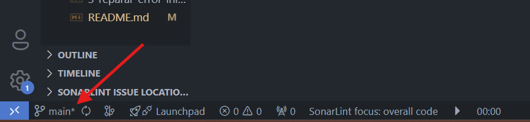
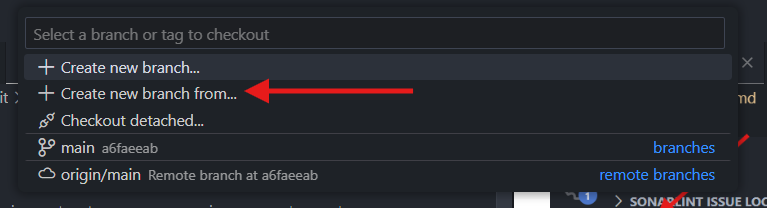
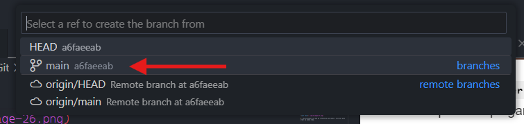
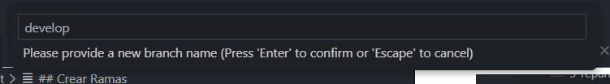
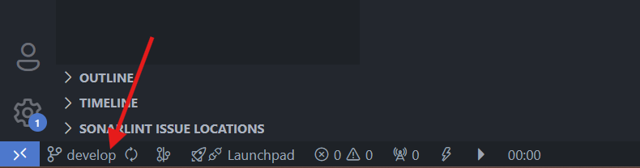
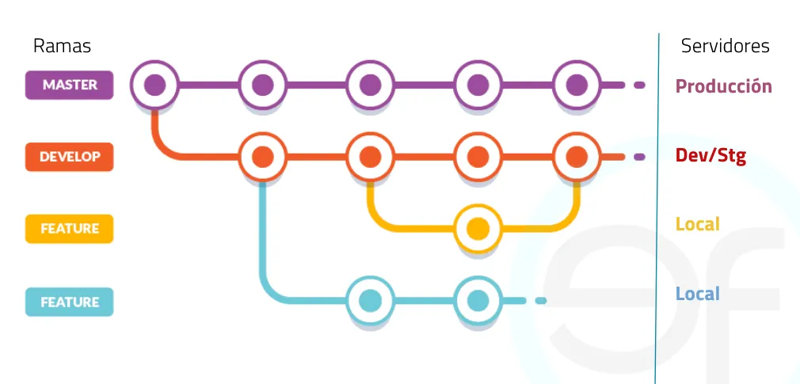

# Comandos Git

## Crear Ramas

La creación de ramas es importante para manejar un adecuado flujo de trabajo, conocido como **Git Flow**.

Podemos observar que nuestra rama principal es la rama **`main / master`**.

La rama **`main / master`** es nuestra rama principal de trabajo, esta rama solo debe ser utilizada para desplegar, compartir el código funcional de nuestra aplicación, por lo tanto no debemos trabajar nuevas funcionalidades en ella.

Para esto debemos crear una nueva rama de trabajo llamada **`develop`** desde la cual vamos a trabajar y crear las ramas para desarrollar nuevas funcionalidades.

Para crear una nueva rama debemos seguir estos pasos:

1. Damos **clic** en el nombre de la rama actual.

2. Se nos abrirá un cuadro en la parte superior en el cual debemos seleccionar la opción **Create new branch from**.

3. Seleccionamos la rama de referencia que vamos a utilizar para crear la nueva rama.

Por lo general la rama actual que tiene el código más actualizado es la que aparece en la primer posición.

4. Escribimos el nombre de nuestra nueva rama, en este caso **`develop`** y presionamos la tecla **`Enter`**.

Podremos observar en la parte inferior del editor que la rama en la que estamos trabajando se llama **`develop`**.

5. Desde esta rama **`develop`** podremos crear las nuevas ramas de trabajo llamadas **`feature-nombre-funcionalidad`**. Este nombre obedece a patrón **Git Flow**.

**Algunas de los tipos de ramas más usadas son:**
**`feature`**: para desarrollar nuevas funcionalidades.
**`hotfix`**: para realizar correciones rápidas.

Ejemplo de un **Git Flow** básico:

Puedes aprender más acerca de **Git Flow** en esta página [Ver más](https://www.atlassian.com/es/git/tutorials/comparing-workflows/gitflow-workflow).