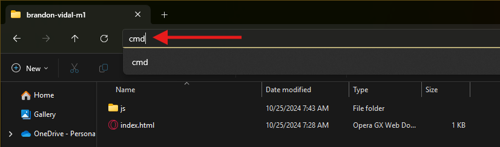
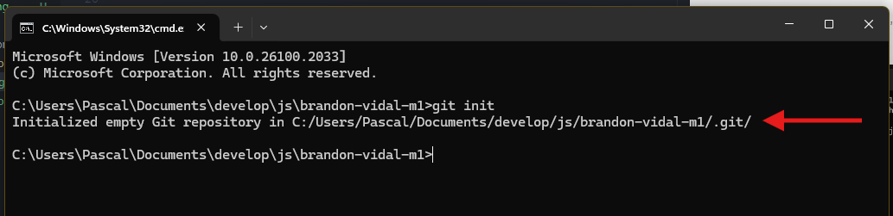

# Comandos Git

## Inicializar un Repositorio

Para inicializar un repositorio en nuestro proyecto, seguimos los siguientes pasos.

### Desde Visual Studio Code

1. Desde **Visual Studio Code** vamos a la opción de **Source Control (Control de código)**


2. Damos clic en **`Initialize Repository (Inicializar repositorio)`**. Sino aparece este botón debemos realizar el proceso desde la Terminal de Windows **`(CMD)`**.

### Desde la Terminal de Windows

Si en **Visual Studio Code** no aparece la opción **`Initialize Repository (Inicializar repositorio)`**, podemos realizar el proceso desde la **Terminal de Windows**.

1. Nos ubicamos en la carpeta donde tenemos los archivos de nuestro proyecto y damos **clic** en la ruta de ubicación, borramos la dirección y escribimos **`(CMD)`**




2. Presionamos la tecla **`Enter`**, esto abrirá la Terminal de Windonws en la ruta de nuestro proyecto.


**Nota:** Debemos fijarnos que estemos ubicados en la ruta del proyecto para continuar con el proceso.

3. En la Terminal escribimos el siguiente comando:

```bash
git init
```

4. Presionamos la tecla **`Enter`** y nos debe aparecer el siguiente mensaje:



Indicando que se inicializó el repositorio.

---

Después de realizar cualquiera de los procesos. Nos ubicamos nuevamente en el **Visual Studio Code** y podremos notar que ahora aparece una lista de archivos con una **`U`** al lado del nombre, la cual quiere decir **`Untracked`**, es decir, que los archivos no están aún guardados en el repositorio en **GitHub**.

