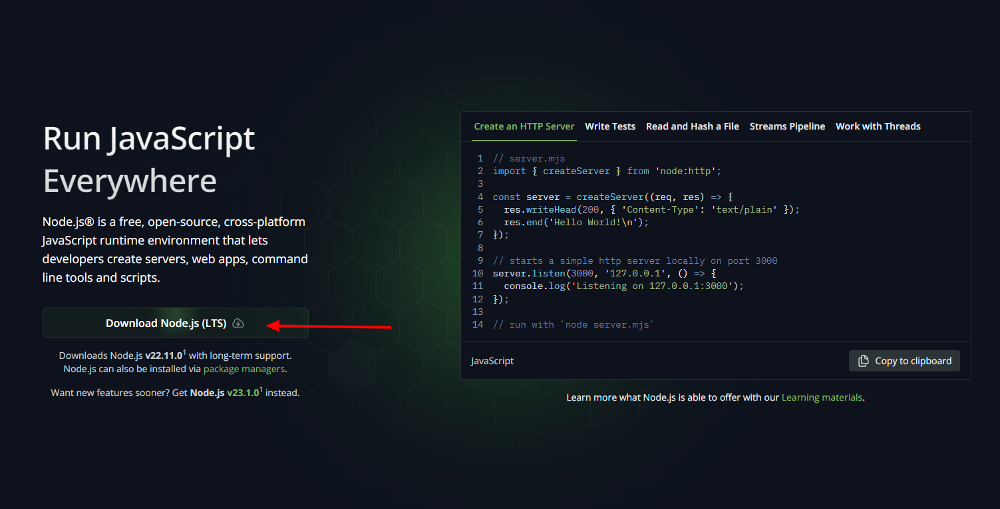

# Node JS

## Instalación de Node JS

Para trabajar el Backend en nuestro proyecto debemos instalar un gestor de paquetes o librerías el cual hará que la configuración del entorno sea mucho más simple y rápida.

Este gestor se llama **Node JS**.

1. Para descargar Node JS vamos a la página oficial para descargarlo: [Ir a la Página](https://nodejs.org/en/).

Damos **clic** en el Botón **Download Node.js (LTS)**.

2. Una vez descargado lo ejecutamos y seguimos el paso a paso para instalar y así quedaría listo el **Node JS** para usarlos en nuestro equipo.
