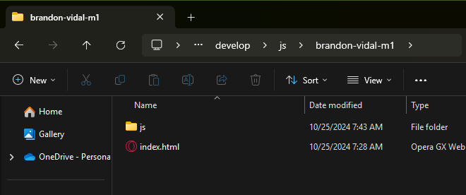
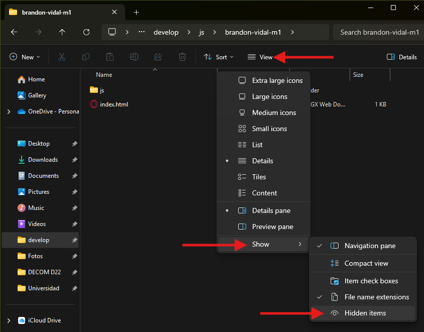
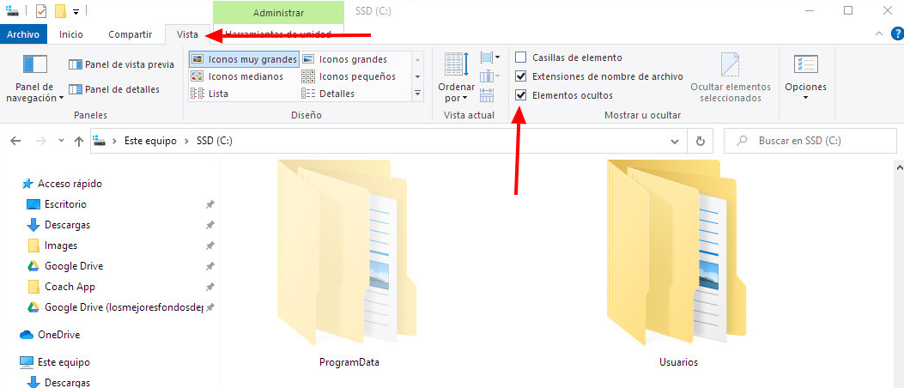
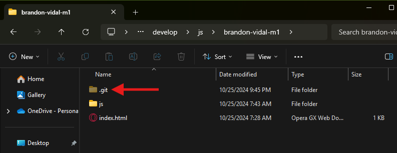

# Comandos Git

## Reparar error de inicialización de Repositorio

Si por algún motivo nuestro Repositorio no inicializa correctamente y no es posile publicar, esto se puede deber a los siguiente:

- Al no inicializar con nuestro **`user`** de **GitHub**.
- Si aparece cualquier otro error.

Debemos seguir los siguientes pasos:

1. Nos ubicamos en la carpeta donde tenemos nuestro proyecto.

2. Activamos la opción de **archivos ocultos**.

- **Windows 11**

- **Windows 10**

3. Podremos observar que aparece una carpeta oculta llamada **`.git`**

4. Borramos esta carpeta para eliminar la configuración incorrecta de nuestro **Repositorio**.

5. Realizamos nuevamente el procedimiento de **Inicializar un Repositorio** [Ver aquí](./3-inicializar-repositorio.md).