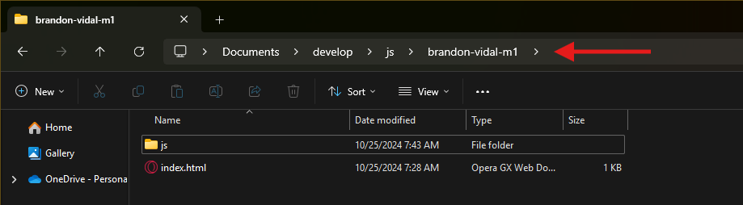
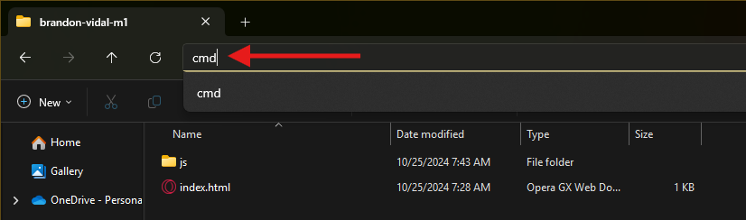
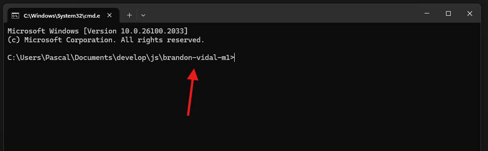

# Configuración Backend

## Inicialización y configuración entorno Backend

Debemos crear una carpeta general para nuestro proyecto la cual se vería de la siguiente forma:

``` bash
nombre-proyecto/
├── backend-service/
├── frontend-app/
```

Ingresamos a la carpeta **backend-service** para comenzar la configuración del Servidor.

1. Damos **clic** en la ruta de ubicación, borramos la dirección y escribimos **`(CMD)`**





2. Presionamos la tecla **`Enter`**, esto abrirá la Terminal de Windonws en la ruta de nuestro proyecto.



3. **Ubicados en la ruta de nuestra carpeta** vamos a instalar las siguientes librerías:

Estas son las librerías y su función:

  - **Express:** Framework para construir aplicaciones web.
  - **TypeScript:** Lenguaje basado en JavaScript para tipado estático.
  - **ts-node-dev:** Herramienta para desarrollo con recarga en tiempo real.
  - **typeorm:** ORM para interactuar con la base de datos.
  - **Reflect-metadata:** Necesario para TypeORM.
  - **Swagger:** Para documentación de API.
  - **Otras utilidades:** cors.

Usamos el siguiente comando para instalar y presionamos la tecla **Enter**:

``` bash
npm install express typeorm reflect-metadata swagger-ui-express swagger-jsdoc cors sqlite3
```

Una vez finaliza esta instalación ejecutamos la siguiente:

``` bash
npm install --save-dev typescript ts-node-dev @types/express @types/node @types/cors @types/swagger-ui-express @types/swagger-jsdoc @types/sqlite3
```

4. Luego de instalar las librerías, abrimos la carpeta **backend-service** en **Visual Studio Code** y dentro de esa carpeta creamos el archivo **`tsconfig.json`** el cual tendrá la configuración básica del lenguaje de programación que utilizaremos, el cual es **TypeScript**.

``` json
{
  "compilerOptions": {
    "target": "ES6",
    "module": "CommonJS",
    "outDir": "./dist",
    "rootDir": "./src",
    "strict": true,
    "esModuleInterop": true,
    "experimentalDecorators": true,
    "emitDecoratorMetadata": true
  }
}
```

Con esto tendríamos la estuctura de la carpeta **backend-service** de la siguiente manera:

``` bash
backend-service/
├── node_modules/
├── package-lock.json
├── package.json
└── tsconfig.json
```

5. Abrimos el archivo **`package.json`** y en la parte de **scripts** agregamos lo siguiente:

``` json
"scripts": {
  "start": "ts-node-dev src/index.ts", // Comando para ejecutar el servidor
  "build": "tsc", // Comando para compilar el servidor
  "prod": "node dist/index.js" // Comando para ejecutar en producción
}
```

6. En la carpeta **backed-service** o la raíz, creamos el archivo **`.gitignore`**, en este archivo colocaremos los archivos y carpetas que no se deben subir al Repositorio:

``` json
node_modules
package-lock.json
```

Con esto tendríamos la estuctura de la carpeta **backend-service** de la siguiente manera:

``` bash
backend-service/
├── node_modules/
├── .gitignore
├── package-lock.json
├── package.json
└── tsconfig.json
```

De esta manera quedaría la configuración básica para trabajar en nuestro backend.