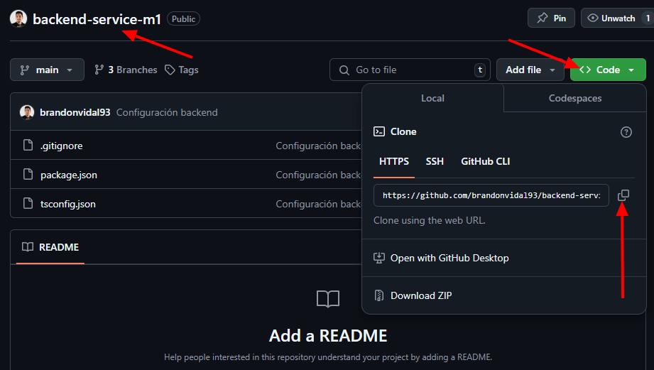
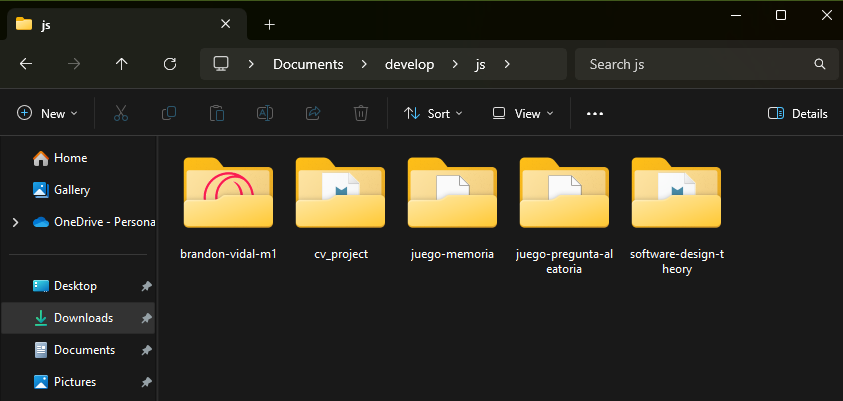
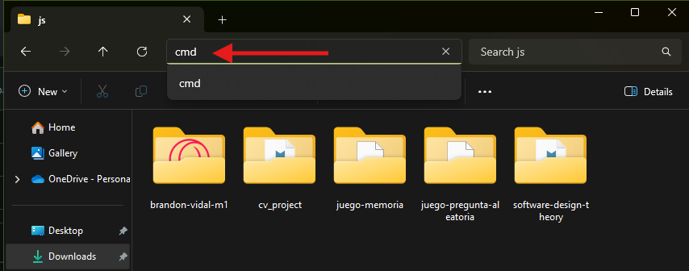
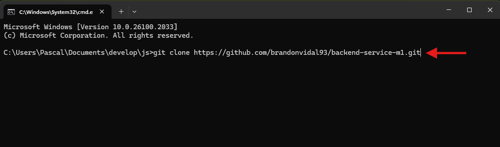
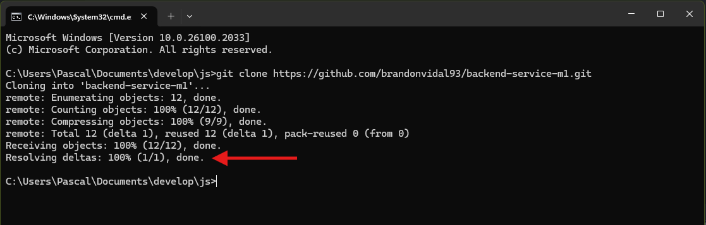
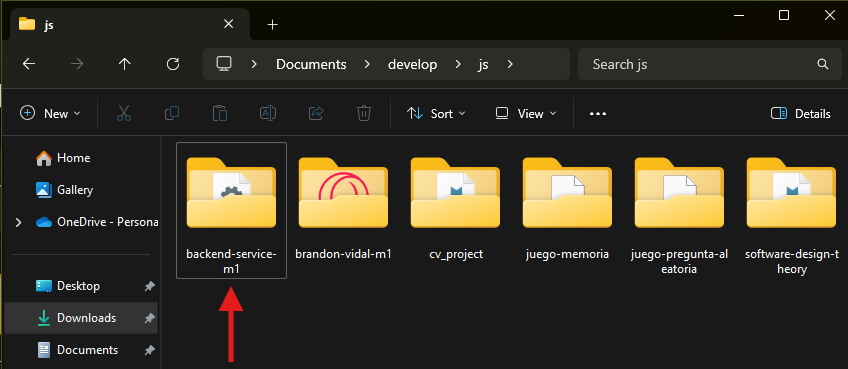

# Comandos Git

## Bajar o Descargar un Repositorio - `Git Clone`

Para descargar un Respositorio ya sea nuestro o de otro desarrollador, debemos seguir estos pasos:

1. Nos ubicamos en el Repositorio en **GitHub** y damos **clic** en el Botón **`<> Code`** y clic en el **Icono de Copiar Url** (Esto es importante para poder pegar la **Url** en la **Terminal**).

2. Nos ubicamos en una carpeta en donde vamos a descargar el Repositorio y damos clic en la ruta de ubicación, borramos la dirección, escribimos **`(CMD)`** y presionamos la tecla **`Enter`** para abrir la **Terminal de Windows**.

3. En la **Terminal de Windows** escribiremos el comando **`git clone`**, presionamos **clic derecho** del **mouse** o las teclas **`ctrl + v`** en la consola para pegar la **Url** del Repositorio y presionamos la tecla **`Enter`** para ejecutar el comando.

Si todo se ejecuta correctamente aparecerá siguiente información en la Terminal y el Repositorio estará descargado en nuestro equipo.

4. Una vez descargado el Repositorio se debe abrir desde **Visual Studio Code** para trabajar en el.