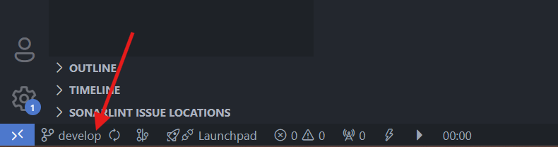

# Comandos Git

## Fusionar Ramas

Una vez que finalizamos el desarrollo de una nueva funcionalidad que por lo general debe estar en una rama **`feature-`** esta rama se debe fusionar con la rama **`develop`** para que quede actualizada y se puedan seguir creando más ramas con el código actualizado.

Para realizar este proceso debemos seguir los siguientes pasos:

1. Si nos encontramos ubicados en la rama **`feature-`** debemos cambiarnos para la rama **`develop`** haciendo **clic** en el nombre de la rama y seleccionar la rama **`develop`**.

Nos fijamos en la parte inferior que estemos en la rama **`develop`**

2. Presionamos las teclas **`ctrl + shift + p`** **para abrir la Paleta de Comandos** y escribrimos **merge o combinar** y seleccionamos la ocpión **`Git: Merge o Git: Combinar`**.

3. Seleccionamos la rama que deseamos fusionar con **`develop`** en este caso **`feature-controller-product`**.

Este procedimiento lo que va a hacer es que va a comparar ambas ramas (**`develop`** y **`feature-`**) y va a colocar en **`develop`** el código nuevo que en **`feature-`**.

4. Para finalizar sincronizamos los cambios para que el Repositorio quede actualizado.

De esta manera nuestra rama **`develop`** está actualizada con los últimos cambios y podremos crear nuevas ramas de trabajo con estos cambios.

**Nota:** Debes tener presente que para fusionar cambios en la rama **`main`** lo que haya desarrollador en **`develop`** debe ser funcional para que pueda ser utilizado por los usuarios.

## [Volver al Menú](../../README.md)