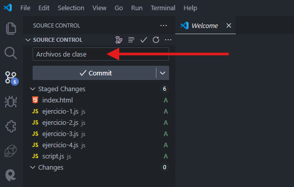
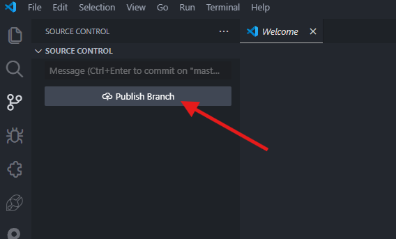
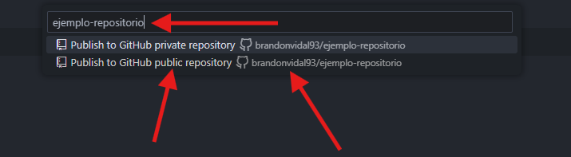
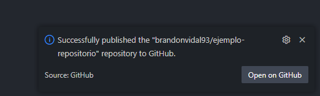
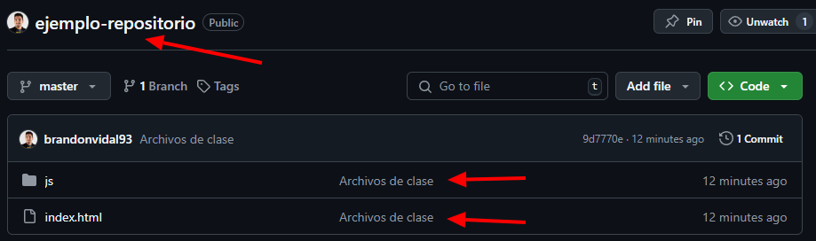

# Comandos Git

## Publicar el Repositorio en GitHub

Para publicar nuestro Repositorio en **GitHub** realizaremos los siguientes pasos:

1. En la pestaña **`Changes`** damos **`clic`** en el botón **`+`** para añadir los archivos a la lista de subida.

Una vez damos **`clic`** veremos que a lado del nombre ya no aparece la letra **`U`** sino la letra **`A (Added)`**, es decir que los archivos ahora se encuentran añadidos a la lista para subir al Repositorio.

Para **Publicar** y/o **Subir** nuestros archivos al Repositorio debemos siempre agregar un mensaje informativo que explique en cortas palabras que es lo que estamos subiendo o que fue lo programamos.

**Nota:** Sino colocamos el mensaje **GitHub** no nos permitirá **Publicar** y/o **Subir**

Una vez tengamos el mensaje y los cambios agregados **Staged Changes**, damos **`clic`** en el botón de **`Commit`**.

Luego damos **`clic`** en **Publish Branch**.

**Nota:** Si el **Visual Studio Code** nos solicita permisos del **GitHub**, habilitamos todos los permisos y luego nos debe aparecer lo siguiente:

En esta parte colocamos el nombre de nuestro **Repositorio** y seleccionamos la opción **`Public repository`**, para que pueda ser visible para los demás desarrolladores.

**Nota:** Verifica que tu usuario se vea en la ruta del **Repositorio**.

Una vez realizado correctamente todo el procedimiento nos debe aparecer un mensaje de confirmación y podremos revisar en nuestro **GitHub** el Repositorio subido.

Dentro del Repositorio podremos ver los archivos que hemos subido y el mensaje que habíamos escrito anteriormente para indicar que es lo que subimos.

