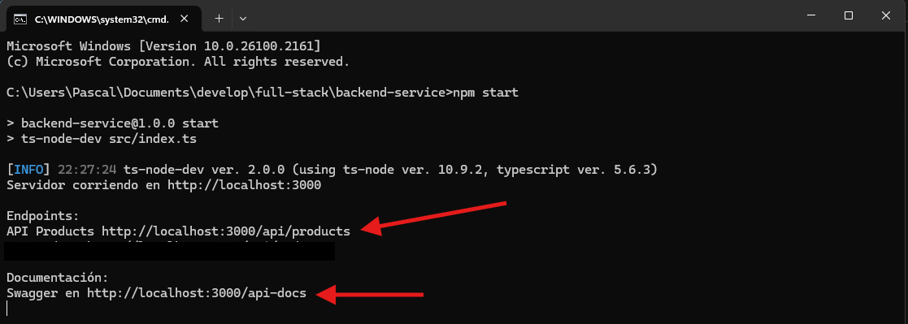
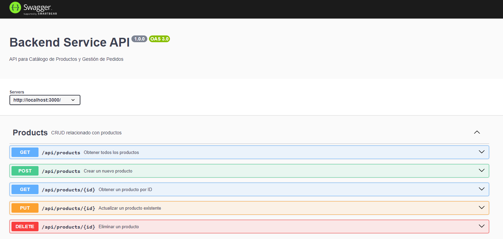
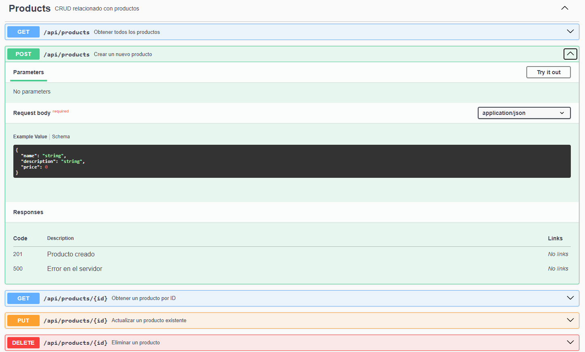

# Desarrollo Backend

## Inicialización del Servidor

Una vez tenemos todo desarrollador y configurado, ingresamos a la carpeta **backend-service** para iniciar nuestro servidor.

1. Damos **clic** en la ruta de ubicación, borramos la dirección y escribimos **`(CMD)`**


2. Presionamos la tecla **`Enter`**, esto abrirá la Terminal de Windonws en la ruta de nuestro proyecto.


Debemos fijarnos que la ruta al final diga **backend-service** que es donde tenemos nuestro proyecto.

3. **Ubicados en la ruta de nuestra carpeta** vamos a ejecutar el comando:

``` bash
npm start
```

Si todo se ejecuta correctamente nos aparecerá una lista de **Urls** del servidor.



- **`http://localhost:3000/api/products`**: La Url que usará la página para comunicarse con la base de datos. Recuerda que si hay más de una **Entidad** estas deben tener **Controlador**, **Rutas** y en el **`index.ts`** llevar su propia **Url**

- **`http://localhost:3000/api-docs`**: Url de documentación del Servicio de **Productos**.

4. Abrimos la Url **`http://localhost:3000/api-docs`** en el navegador para visualizar la documentación.



Aquí nos aparecerán cada uno de los métodos para el Sericio de **Productos**.



Al desplegar cada uno de los métodos encontraremos la información necesaria para realizar la petición en este cado del método **POST** y guardar un nuevo producto, sus códigos de respuesta y respectivo mensaje.
