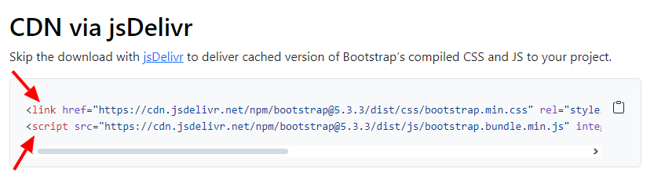

# Desarrollo Frontend

## Creando archivos `html`

En la carpeta de nuestro proyecto creamos una carpeta llamada **frontend-app**.

``` bash
nombre-proyecto/
├── backend-service/
└── frontend-app/
```

Abrimos la carpeta **frontend-app** en **Visual Studio Code** y allí creamos nuestro primer archivo **`index.html`** el cual es el principal de todo Sitio Web.

En este archivo colocamos la configuración inicial de todo archivo **html**.

``` html
<!doctype html>
<html lang="en">
  <head>
    <meta charset="utf-8">
    <meta name="viewport" content="width=device-width, initial-scale=1">
    <title>Título de la Página</title>
  </head>
  <body>
    
  </body>
</html>
```

### Explicación

Los archivos **html** se usan para estructurar las páginas web, y se componen de etiquetas las cuales dan forma y tienen un uso específico.

La estructura de una etiqueta **html** es la siguiente:

``` html
<nombre-etiqueta atributo1="valor" atributo2="valor">
  Contenido de la etiqueta puede ser **texto** o **más etiquetas**.
</nombre-etiqueta>
```

Las etiquetas html básica para tener un archivo **html** funcional son:

- **`<!doctype html>`** Le dice al navegador que el archivo es **html**.
- **`<html>`** Etiqueta principal del archivo.
- **`<head>`** Contiene la configuración de la página.
- **`<meta>`** Configuraciones como el SEO, Idioma, Adaptabilidad de la página.
- **`<title>`** Título de la página que aparece en la pestaña o ventana del navegador.
- **`<body>`** Es el cuerpo de la página dentro de esta van todas la etiquetas y elementos **html**.

Puedes leer más sobre la documentación HTML aquí [Ver más](https://developer.mozilla.org/es/docs/Web/HTML)

### Agregando Bootstrap a nuestro proyecto

Bootstrap es un Framework de componentes **html** y estilos **css** el cual nos ayudará a agilizar el maquetado o estructuración de nuestro proyecto.

Para instalarlo hacemos lo siguiente:

1. Ingresamos a la página de Bootstrap [Ver aquí](https://getbootstrap.com/docs/5.3/getting-started/introduction/)

2. Damos clic en la opción **Download**.

3. Buscamos los links por **CDN**. Ponemos la etiqueta **`<link>`** dentro de la etiqueta **`<head>`** y la etiqueta **`<script>`** dentro de la etiqueta **`<body>`**.



4. El archivo **`index.html`** nos debe quedar de la siguiente forma:

#### Archivo `index.html`

``` html
<!doctype html>
<html lang="en">
  <head>
    <meta charset="utf-8">
    <meta name="viewport" content="width=device-width, initial-scale=1">
    <title>Título de la Página</title>

    <!-- Estilos Bootstrap -->
    <link href="https://cdn.jsdelivr.net/npm/bootstrap@5.3.3/dist/css/bootstrap.min.css" rel="stylesheet" integrity="sha384-QWTKZyjpPEjISv5WaRU9OFeRpok6YctnYmDr5pNlyT2bRjXh0JMhjY6hW+ALEwIH" crossorigin="anonymous">
  </head>
  <body>
    
    <!-- Componentes -->
    <script src="https://cdn.jsdelivr.net/npm/bootstrap@5.3.3/dist/js/bootstrap.bundle.min.js" integrity="sha384-YvpcrYf0tY3lHB60NNkmXc5s9fDVZLESaAA55NDzOxhy9GkcIdslK1eN7N6jIeHz" crossorigin="anonymous"></script>
  </body>
</html>
```

### Creando archivo `html` donde va nuestro formulario

La forma de guardar información en nuestro **Backend** por medio de una página web es con formularios, debemos crear un nuevo archivo en el cual irán los elementos del formulario.

En nuestra carpeta **frontend-app** creamos otro archivo con el nombre **`add-product.html`**, en donde **product** sera el nombre de la entidad de cada proyecto, ejemplo **`add-juego.html`**, **`add-libro.html`** o **`add-moto.html`**.

Nuestra carpeta debe quedar con los siguientes archivos:

``` bash
frontend-app/
├── add-product.html
└── index.html
```

En este nuevo archivo **html** debe ir también la estructura previamente creada en el archivo **`index.html`**.

#### Archivo `add-product.html`

``` html
<!doctype html>
<html lang="en">
  <head>
    <meta charset="utf-8">
    <meta name="viewport" content="width=device-width, initial-scale=1">
    <title>Añadir Producto</title>

    <!-- Estilos Bootstrap -->
    <link href="https://cdn.jsdelivr.net/npm/bootstrap@5.3.3/dist/css/bootstrap.min.css" rel="stylesheet" integrity="sha384-QWTKZyjpPEjISv5WaRU9OFeRpok6YctnYmDr5pNlyT2bRjXh0JMhjY6hW+ALEwIH" crossorigin="anonymous">
  </head>
  <body>
    
    <!-- Componentes -->
    <script src="https://cdn.jsdelivr.net/npm/bootstrap@5.3.3/dist/js/bootstrap.bundle.min.js" integrity="sha384-YvpcrYf0tY3lHB60NNkmXc5s9fDVZLESaAA55NDzOxhy9GkcIdslK1eN7N6jIeHz" crossorigin="anonymous"></script>
  </body>
</html>
```

## [Volver al Menú](../../README.md)