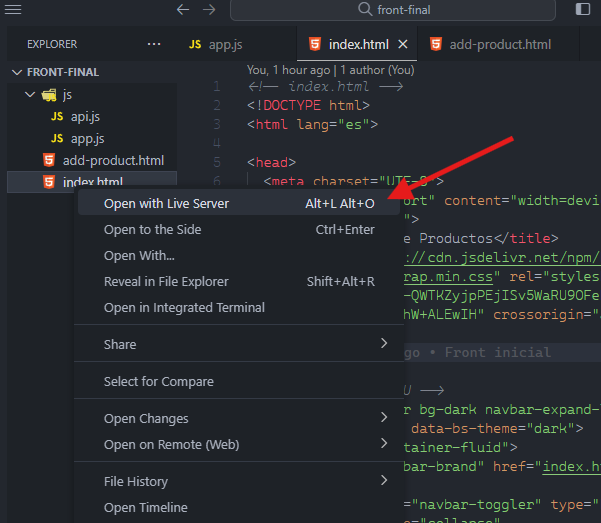

# Desarrollo Frontend

## Probando nuestra aplicación

Una vez finalicemos nuestra aplicación Frontend, debemos probar que nos funcione la conexción con el Backend, para esto seguimos lo siguientes pasos:

1. Nos ubicamos en la carpeta donde tenemos nuestro **Backend** y la abrimos con el **`CMD`** y ejecutamos la siguiente linea:

``` bash
npm start
```

Esto iniciará el Backend con los servicios que creamos previamente.

Si todo marcha bien se debe ver algo así en nuestra consola:


**Nota:** No se debe cerrar la consola donde ejecutamos el Backend.

2. En nuestro proyecto Frontend abierto en Visual, comprobamos que tengamos la extención **Live Server** instalada, sino, la intalamos.

**Extensión Live Server**


3. Damos clic derecho sobre nuestro archivo **`index.html`** y seleccinamos la opción **Open with Live Server**.



4. Si todo marcha correctamente y hemos configurado nuestro Backend y Frontend sin problemas podremos ver una páginas con lo siguiente:

#### Página principal con todos los productos


#### Página formulario para agregar información


## [Volver al Menú](../../README.md)